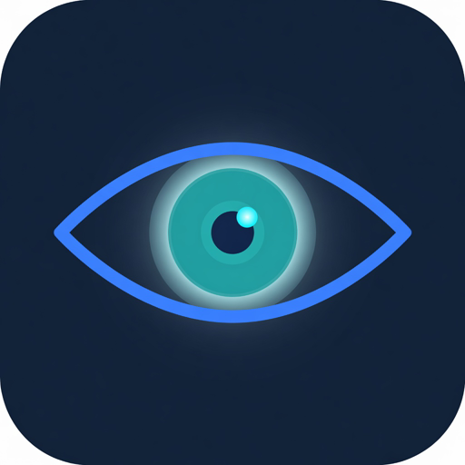
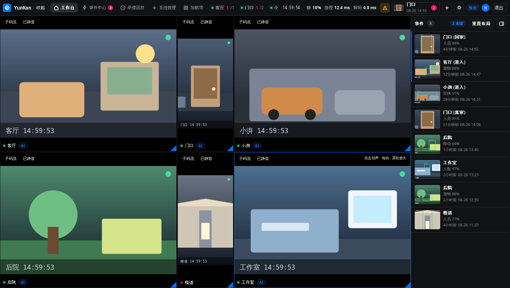
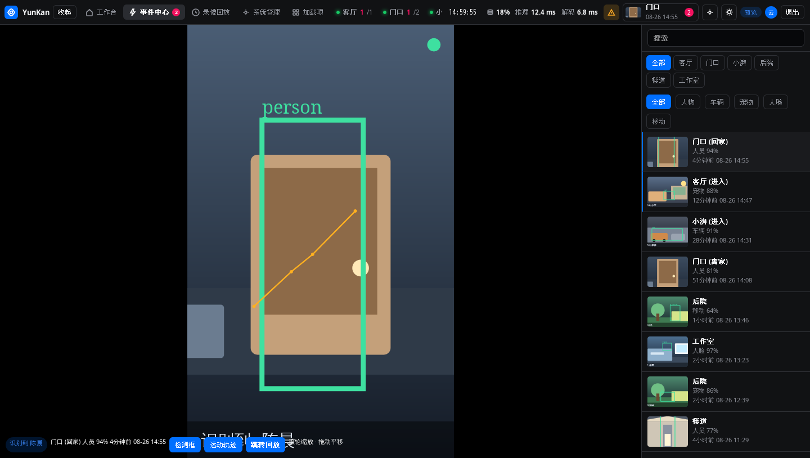
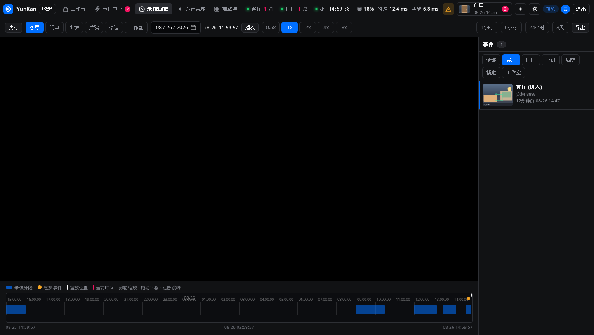
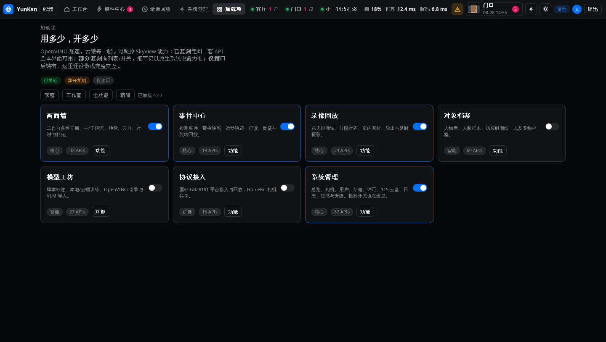
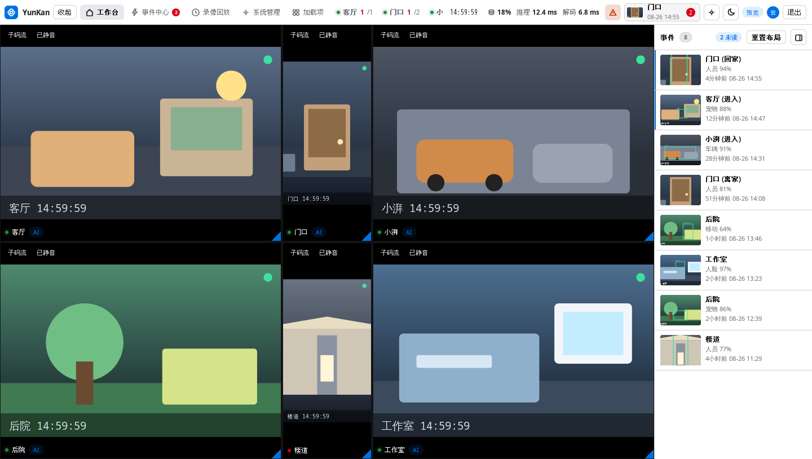
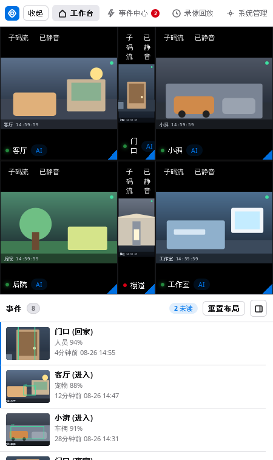
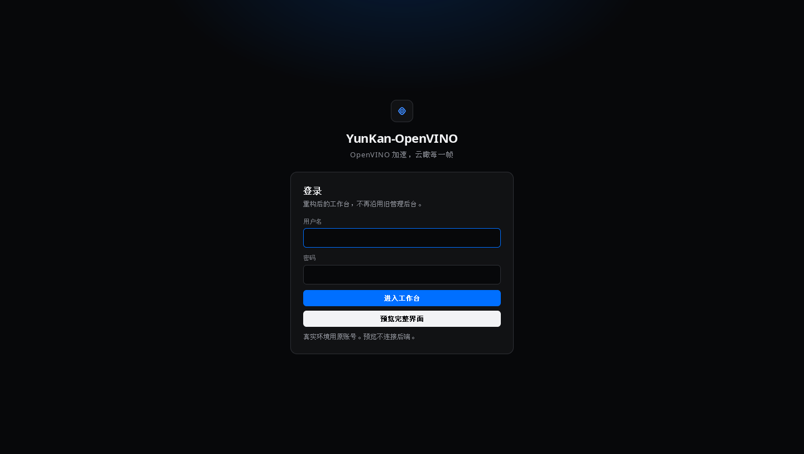

# YunKan-OpenVINO UI



**给 [云瞰 YunKan](https://github.com/mrtian2016/yunkan) 用的另一套 Web 工作台 —— 自由拼贴直播、AI 事件、时间轴回放。推理在盒子上，页面在浏览器里。**

[](LICENSE)
[](https://hub.docker.com/r/s1oz/yunkan-ui)
[](https://github.com/mrtian2016/yunkan)

[English](./README.md) · 官方产品：[mrtian2016/yunkan](https://github.com/mrtian2016/yunkan) · [yun-kan.com](https://yun-kan.com/zh-CN)

---

这是一套**重写的 Web 界面**，不是原管理后台换皮。它对接官方 Docker 镜像已经提供的本地 API。录像和推理都留在你自己的机器上。

> 非官方项目，与云瞰作者无隶属或背书关系。云瞰本体是商业闭源软件，按户授权。

口号：**OpenVINO 加速，云瞰每一帧**。

## 界面截图

以下均为内置演示数据，没有真实摄像头，也没有内网地址。

| 工作台拼贴 | AI 事件中心 |
| :---: | :---: |
|  |  |
| **录像回放 · 时间轴** | **加载项** |
|  |  |
| **白天主题** | **手机** |
|  |  |

登录 / 预览：

## 能做什么

- 🖥️ **自由拼贴工作台** —— 拖动、拉伸，竖屏门口和横屏客厅可以混排。点哪一路画面，就只出那一路声音。
- 🔊 **浏览器能播的直播声音** —— 画面走 `live` / `detect` HLS，声音走 AAC 旁路。主码流 H.265 播不了会回退子码流。
- ⚡ **事件栏** —— 摄像机 + 回家/离家，类型 + 置信度，相对时间和墙上时钟。右侧可折叠，画面铺满。
- 🎯 **事件中心** —— 标注快照、检测框、运动轨迹，滚轮缩放 + 拖动平移，一键跳转回放。
- 📼 **时间轴回放** —— 分段、事件、倍速、页内实时。右侧可筛 **全部** 或某一路摄像机。
- 🧩 **加载项** —— 人物档案、训练、国标、HomeKit 等按需打开，用多少开多少。
- 🌙 **白天 / 黑夜** —— 顶栏一个按钮切换。
- ⚙️ **原生系统设置** —— 齿轮打开官方管理后台：用**当前主机名**，端口 `23406`（不是写死的 IP）。

## 运行条件

- 已经在跑的 **云瞰 / YunKan** 实例。本仓库不负责录像、检测或存盘。
- Python 3.9+（静态服务只用标准库，不用 pip）。
- Chromium / Firefox 系浏览器（自带 [hls.js](https://github.com/video-dev/hls.js/)）。

官方镜像常见端口：

| 端口 | 用途 |
| --- | --- |
| `23326` | REST API |
| `23406` | 官方 Web 管理端 + HLS 媒体 |

## 启动

不接后端、只看演示界面：

```bash
python3 serve.py --host 0.0.0.0 --port 18081
```

打开 http://127.0.0.1:18081/ ，点 **预览完整界面**，或在地址后加 `?demo=1`。

对接真实云瞰：

```bash
python3 serve.py \
  --api   http://127.0.0.1:23326 \
  --media http://127.0.0.1:23406 \
  --host  0.0.0.0 \
  --port  18081
```

也可以：

```bash
export YUNKAN_API=http://127.0.0.1:23326
export YUNKAN_MEDIA=http://127.0.0.1:23406
./start.sh
```

用官方界面同一套账号登录。本进程只反向代理 `/api/`、快照和 HLS，不会保存密码。

环境变量（Docker 同样认这些）：

| 变量 | 默认 | 用途 |
| --- | --- | --- |
| `YUNKAN_API` | `http://127.0.0.1:23326` | REST API |
| `YUNKAN_MEDIA` | `http://127.0.0.1:23406` | 官方管理端 + HLS |
| `PORT` | `18081` | 监听端口 |
| `TZ` | `Asia/Shanghai` | 容器时区 |

需要覆盖时把 [`.env.example`](./.env.example) 复制成 `.env`。

## Docker

不替换官方云瞰容器，只作为旁路工作台。镜像：**[s1oz/yunkan-ui](https://hub.docker.com/r/s1oz/yunkan-ui)**（另有 `ghcr.io/s1oz/yunkan-ui`）。

### 拉取即用（和云瞰同一台机器）

```bash
docker pull s1oz/yunkan-ui:latest
docker run -d --name YunKan-UI --network host --restart unless-stopped \
  -e YUNKAN_API=http://127.0.0.1:23326 \
  -e YUNKAN_MEDIA=http://127.0.0.1:23406 \
  -e PORT=18081 \
  s1oz/yunkan-ui:latest
```

打开 `http://<主机>:18081/`。必须用 **host** 网络，`127.0.0.1:23326` / `:23406` 才能打到本机云瞰。

### Compose（拉取或本地构建）

```bash
git clone https://github.com/s1oz/yunkan-ui.git
cd yunkan-ui
docker compose up -d
```

`docker compose up -d --build` 会用当前仓库重新构建，而不是只拉镜像。

### 云瞰在另一台机器

```bash
docker run -d --name YunKan-UI -p 18081:18081 --restart unless-stopped \
  -e YUNKAN_API=http://192.168.1.10:23326 \
  -e YUNKAN_MEDIA=http://192.168.1.10:23406 \
  s1oz/yunkan-ui:latest
```

bridge 网络下 **不要** 把 `YUNKAN_*` 写成 `127.0.0.1`（那是 UI 容器自己）。

### 本地构建

```bash
docker build -t s1oz/yunkan-ui:latest .
```

发布（维护者）：`docker push s1oz/yunkan-ui:latest`，以及 `docker push ghcr.io/s1oz/yunkan-ui:latest`。

### 自动构建推送到 Docker Hub（GitHub Actions）

工作流 [`.github/workflows/docker.yml`](./.github/workflows/docker.yml) 会在每次推送 `main`（以及打 `v*` 标签）时构建，并推送到 `s1oz/yunkan-ui` 和 `ghcr.io/s1oz/yunkan-ui`。同时会更新 Docker Hub 上的**短简介**和完整说明。

只需在 GitHub 配一次密钥：

1. 打开 [Docker Hub](https://hub.docker.com/) → 右上角头像 → **Account Settings** → **Personal access tokens** → **Generate new token**。权限选 **Read, Write, Delete**，生成后立刻复制（只显示一次）。
2. 打开 GitHub 仓库 [s1oz/yunkan-ui](https://github.com/s1oz/yunkan-ui) → **Settings** → **Secrets and variables** → **Actions** → **New repository secret**：
   - Name：`DOCKERHUB_TOKEN`
   - Secret：上一步的 token
3. 之后每次 `git push origin main`，或在 **Actions** 里打开 **docker** 工作流点 **Run workflow**，就会自动构建并推送。
4. 第一次推到 GHCR 后：GitHub → **Packages** → `yunkan-ui` → Package settings → 若希望别人免登录拉取，把可见性改成 **Public**。

Docker Hub 网站上的 “Automated Builds”（把 GitHub 绑到 Hub 的 Builds）**不必再开**。已经用 GitHub Actions 了，两边一起开会构建两次。

## Unraid

1. 云瞰已经在跑（应用市场：**YunKan-OpenVINO** / CUDA / CPU）。不要动它。
2. 添加容器，镜像填 `s1oz/yunkan-ui:latest`，网络选 **host**，环境变量 `YUNKAN_API=http://127.0.0.1:23326`、`YUNKAN_MEDIA=http://127.0.0.1:23406`、`PORT=18081`。或克隆后 Compose：

```bash
git clone https://github.com/s1oz/yunkan-ui.git /mnt/user/appdata/yunkan-ui
cd /mnt/user/appdata/yunkan-ui
docker compose up -d
```

3. Docker 页会出现 **YunKan-UI**。地球图标打开 `http://[IP]:18081/`。图标是 [unraid-icon.png](./unraid-icon.png)。

可选：把 [`templates/unraid.xml`](./templates/unraid.xml) 拷到 `/boot/config/plugins/dockerMan/templates-user/my-YunKan-UI.xml`，之后「添加容器」能选这个模板。不要 Compose 和模板各起一份。

## 「跳转原生系统设置」怎么拼地址

顶栏齿轮**没有写死 IP**。它打开：

```text
当前页面的协议 + 当前主机名 + :23406/settings
```

例如你从 `http://nas.local:18081/` 打开本 UI，齿轮会去 `http://nas.local:23406/settings`。若官方管理端不在 23406，可在浏览器控制台执行：

```js
localStorage.setItem("yunkan.origUi", "http://你的主机:端口/settings")
```

## 目录

```text
public/              静态界面（HTML / CSS / JS）
  js/vendor/         hls.js
serve.py             静态文件 + 同源反代
start.sh / start.bat Linux / Windows 启动
Dockerfile           python:3.12-alpine 旁路容器
docker-compose.yml   host 网络 compose（Unraid Compose Manager 可用）
.github/workflows    构建并推送 s1oz/yunkan-ui 到 Docker Hub 和 GHCR
docs/dockerhub.md    Docker Hub 完整简介（截图用 GitHub 绝对地址）
templates/unraid.xml Unraid Docker 模板
unraid-icon.png      Unraid Docker 页图标
docs/screenshots     README 配图（演示数据）
```

`preview/` 是本地抓图草稿，不进入公开发布。

## 隐私

本仓库包含：

- 没有局域网 IP
- 没有 token / 密码
- 没有真实监控画面（README 配图全部来自内置演示插画）

不要把接了真实 NVR 的 `preview/` 截图提交上去，里面可能有家庭画面。

## 许可

本 UI 使用 MIT，见 [LICENSE](./LICENSE)。

云瞰产品本身仍是商业闭源。请只在你有权运行的后端上使用本工作台。

---

*OpenVINO 加速，云瞰每一帧。*
